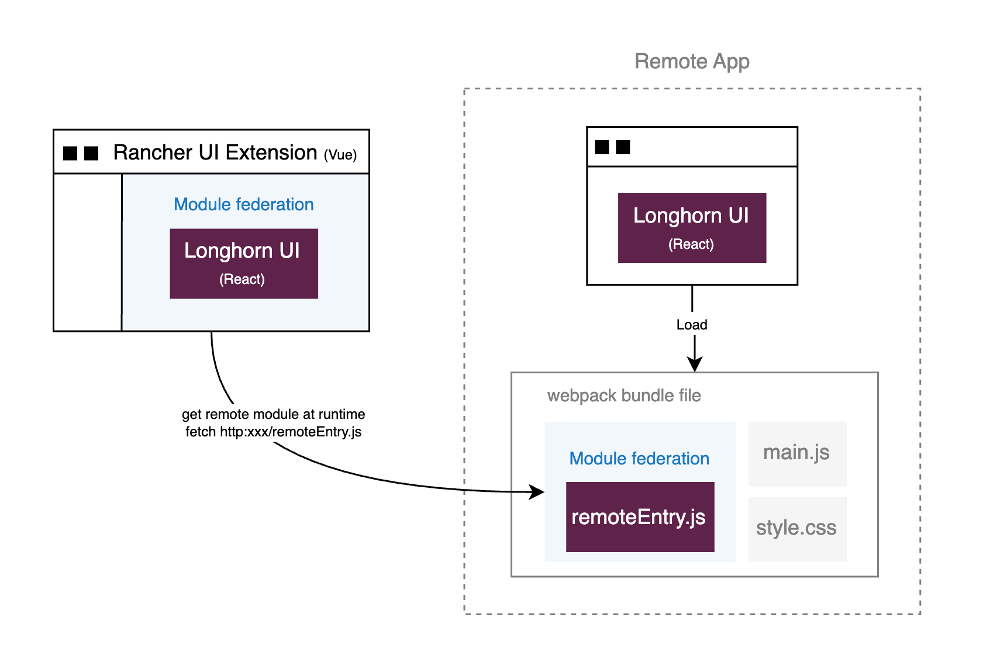

# React in Vue: Module Federation

## Overview

Integrate a React app into a Vue.js app using Webpack’s **Module Federation**.
<br />
The goal is to demonstrate how different frameworks can coexist in a single application, enabling independent development and deployment of micro-frontends.



## Project Setup

1. set up Rancher UI extension (Vue@3)
```
yarn install
```
```
API=<Rancher Backend URL> yarn dev
```

2. set up Longhorn UI (React@16)
```
cd longhorn-ui
```
```
npm install
```
```
LONGHORN_MANAGER_IP=<Longhorn Backend API> npm run dev
```
